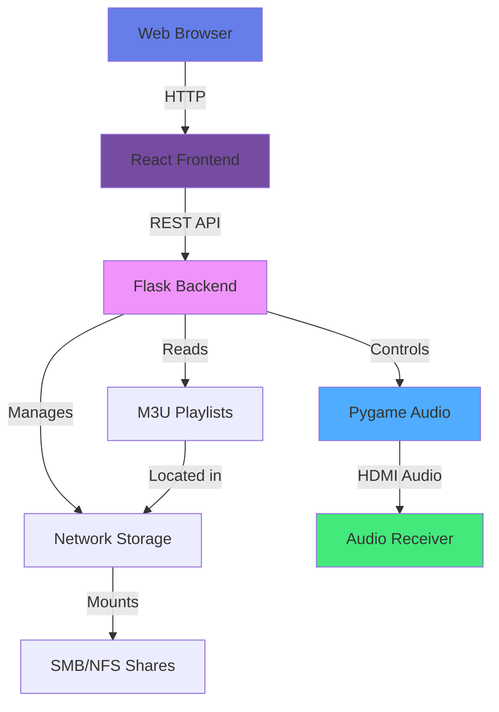
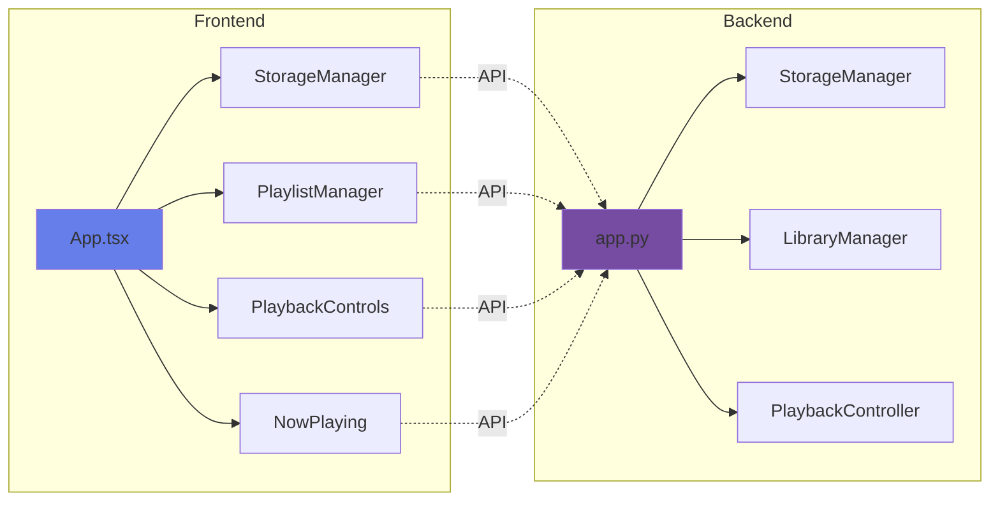

# Media Player

A comprehensive media player system designed for Raspberry Pi with network storage support, web-based control interface, and playlist management.

## 🎯 Features

- **Network Storage Management**: Configure SMB/CIFS and NFS network storage locations
- **Playlist Management**: Organize your media files into playlist folders
- **Playlist Support**: Play M3U and M3U8 playlist files
- **Web-Based Control**: Modern React-based UI accessible from any device on your network
- **Advanced Playback Controls**: 
  - Play, pause, stop, skip tracks, and adjust volume
  - Shuffle mode for randomized playback
  - Repeat modes (off, all tracks, single track)
  - Progress bar with seek functionality
  - Track time display (current position / total duration)
  - Visual crossfade indicators
- **Real-Time Status**: See what's currently playing in real-time
- **Raspberry Pi Optimized**: Designed to run on Raspberry Pi with HDMI audio output

## 📋 Table of Contents

- [Architecture](#architecture)
- [Prerequisites](#prerequisites)
- [Installation](#installation)
- [Configuration](#configuration)
- [Usage](#usage)
- [Raspberry Pi Setup](#raspberry-pi-setup)
- [Development](#development)
- [Troubleshooting](#troubleshooting)

## 🏗️ Architecture



### Component Overview



## 📦 Prerequisites

### For Development and Testing

- Python 3.8 or higher
- Node.js 14 or higher
- npm or yarn

### For Raspberry Pi Deployment

- Raspberry Pi (3 or newer recommended)
- Raspberry Pi OS (formerly Raspbian)
- HDMI cable connected to audio receiver
- Network connection (WiFi or Ethernet)

## 🚀 Installation

### Quick Start (Development)

1. **Clone the repository**
   ```bash
   git clone https://github.com/xXLAOKOONXx/media-player.git
   cd media-player
   ```

2. **Install backend dependencies**
   
   **Option A: Using uv (recommended - 10x faster):**
   ```bash
   cd backend
   # Install uv if not already installed
   curl -LsSf https://astral.sh/uv/install.sh | sh
   
   # Create virtual environment and install dependencies
   uv venv
   source .venv/bin/activate  # On Windows: .venv\Scripts\activate
   uv pip install -e .
   ```
   
   **Option B: Using traditional pip:**
   ```bash
   cd backend
   pip install -r requirements.txt
   ```
   
   See [UV Setup Guide](docs/UV_SETUP.md) for more details.

3. **Build and start the application**
   ```bash
   # Build frontend (from project root)
   cd frontend
   npm install
   npm run build
   
   # Start backend (serves both API and frontend)
   cd ../backend
   python app.py
   ```
   
   The application will run on `http://localhost:5000`

4. **Access the application**
   Open your web browser and navigate to `http://localhost:5000`

### Development Mode (Frontend Hot Reload)

For frontend development with hot reload:

```bash
# Terminal 1 - Backend API
cd backend
python app.py

# Terminal 2 - Frontend dev server with proxy
cd frontend
npm run dev
```

Then access the frontend at `http://localhost:5173` (Vite's default port)

### Production Build

1. **Build the frontend**
   ```bash
   cd frontend
   npm run build
   ```

2. **Serve the frontend through Flask** (optional)
   You can configure Flask to serve the built React app, or use a reverse proxy like nginx.

## 🔧 Configuration

### Backend Configuration

The backend stores configuration in `config.json` in the backend directory. This file is automatically created and managed through the web interface.

Example `config.json`:
```json
{
  "network_storages": [
    {
      "id": 1,
      "name": "NAS Music",
      "type": "smb",
      "host": "192.168.1.100",
      "share": "music",
      "username": "user",
      "password": "password",
      "mount_point": "/mnt/media_1"
    }
  ],
  "playlists": [
    {
      "id": 1,
      "name": "My Playlists",
      "type": "playlist",
      "path": "/mnt/media_1/playlists",
      "storage_id": 1
    }
  ]
}
```

### Frontend Configuration

Create a `.env` file in the `frontend` directory:

```env
REACT_APP_API_URL=http://localhost:5000
```

For production on Raspberry Pi:
```env
REACT_APP_API_URL=http://raspberrypi.local:5000
```

## 📖 Usage

### 1. Configure Network Storage

1. Navigate to the **Storage** tab
2. Click **+ Add Storage**
3. Fill in the storage details:
   - Storage Name: A friendly name for your storage
   - Type: SMB/CIFS or NFS
   - Host/Server: IP address or hostname
   - Share Name: The network share name
   - Username/Password: Credentials for accessing the share
4. Click **Add Storage**

### 2. Add Playlist Folders

1. Navigate to the **Playlists** tab
2. Click **+ Add Playlist Folder**
3. Enter a folder name and path to your playlist folder
4. Use the **Browse** button to navigate your filesystem
5. Click **Add Playlist Folder**
6. Use the ✏️ button to rename or 🗑️ button to delete a playlist folder

### 3. Play Music

1. In the **Playlists** tab, select a playlist folder
2. Browse the available playlists
3. Click **Play** on any playlist to start playback
4. Navigate to the **Player** tab to control playback

### 4. Control Playback

In the **Player** tab, you can:
- **Shuffle** (🔀): Toggle shuffle mode to randomize track playback order
- **Repeat** (↻/🔁/🔂): Cycle through repeat modes:
  - ↻ Off: Play playlist once and stop
  - 🔁 All: Repeat entire playlist
  - 🔂 One: Repeat current track
- **Play/Pause**: Start or pause playback
- **Stop**: Stop playback completely
- **Previous/Next**: Navigate between tracks
- **Volume**: Adjust the playback volume
- **Progress Bar**: Click or drag to seek to any position in the current track
- **Track Time**: View current position and total duration
- **Crossfade Indicator**: Green gradient shows where track will fade out (last 5 seconds)
- **Now Playing**: See the current track information

## 🍓 Raspberry Pi Setup

### Hardware Setup

1. Connect Raspberry Pi to audio receiver via HDMI
2. Ensure network connectivity (WiFi or Ethernet)
3. Optional: Connect keyboard and monitor for initial setup

### Software Installation

1. **Install Raspberry Pi OS**
   ```bash
   # Update system
   sudo apt update
   sudo apt upgrade -y
   ```

2. **Install Python dependencies**
   ```bash
   sudo apt install -y python3 python3-pip python3-pygame
   cd ~/media-player/backend
   pip3 install -r requirements.txt
   ```

3. **Install Node.js** (for building frontend)
   ```bash
   curl -fsSL https://deb.nodesource.com/setup_18.x | sudo -E bash -
   sudo apt install -y nodejs
   ```

4. **Build frontend**
   ```bash
   cd ~/media-player/frontend
   npm install
   npm run build
   ```

5. **Configure audio output to HDMI**
   ```bash
   # Edit config.txt
   sudo nano /boot/config.txt
   
   # Add or uncomment:
   hdmi_drive=2
   
   # Set audio output
   sudo raspi-config
   # Navigate to: System Options -> Audio -> HDMI
   ```

6. **Install network storage support**
   ```bash
   # For SMB/CIFS
   sudo apt install -y cifs-utils
   
   # For NFS
   sudo apt install -y nfs-common
   ```

### Auto-Start on Boot

Create a systemd service:

1. **Create backend service**
   ```bash
   sudo nano /etc/systemd/system/mediaplayer.service
   ```

   ```ini
   [Unit]
   Description=Media Player Backend
   After=network.target

   [Service]
   Type=simple
   User=pi
   WorkingDirectory=/home/pi/media-player/backend
   ExecStart=/usr/bin/python3 /home/pi/media-player/backend/app.py
   Restart=always
   RestartSec=10

   [Install]
   WantedBy=multi-user.target
   ```

2. **Enable and start service**
   ```bash
   sudo systemctl daemon-reload
   sudo systemctl enable mediaplayer.service
   sudo systemctl start mediaplayer.service
   ```

3. **Check status**
   ```bash
   sudo systemctl status mediaplayer.service
   ```

### Accessing the UI

Once running, access the web interface from any device on your network:
- `http://raspberrypi.local:3000` (if mDNS is enabled)
- `http://[RASPBERRY_PI_IP]:3000`

## 👨‍💻 Development

### Project Structure

```
media-player/
├── backend/                 # Python Flask backend
│   ├── app.py              # Main Flask application
│   ├── storage_manager.py  # Network storage handling
│   ├── library_manager.py  # Playlist and library management
│   ├── playback_controller.py # Audio playback control
│   └── requirements.txt    # Python dependencies
├── frontend/               # React frontend
│   ├── src/
│   │   ├── components/    # React components
│   │   │   ├── StorageManager.tsx
│   │   │   ├── PlaylistManager.tsx
│   │   │   ├── PlaybackControls.tsx
│   │   │   └── NowPlaying.tsx
│   │   ├── App.tsx        # Main App component
│   │   └── index.tsx      # Entry point
│   └── package.json       # npm dependencies
└── docs/                   # Documentation
```

### API Endpoints

#### Storage Management
- `GET /api/storage` - List all network storages
- `POST /api/storage` - Add new network storage
- `DELETE /api/storage/:id` - Delete network storage

#### Playlist Management
- `GET /api/playlists` - List all playlist folders
- `POST /api/playlists` - Add new playlist folder
- `PUT /api/playlists/:id` - Rename playlist folder
- `DELETE /api/playlists/:id` - Delete playlist folder
- `GET /api/playlists/:id/files` - Get playlists in folder

#### Playback Control
- `POST /api/playback/play` - Start/resume playback
- `POST /api/playback/pause` - Pause playback
- `POST /api/playback/stop` - Stop playback
- `POST /api/playback/next` - Next track
- `POST /api/playback/previous` - Previous track
- `POST /api/playback/volume` - Set volume
- `POST /api/playback/shuffle` - Toggle shuffle mode
- `POST /api/playback/repeat` - Set repeat mode (none/all/one)
- `POST /api/playback/seek` - Seek to position in track
- `GET /api/playback/status` - Get playback status (includes shuffle, repeat, position)

#### File System
- `POST /api/browse` - Browse filesystem path

### Making Changes

1. For backend changes, modify files in `backend/` directory
2. For frontend changes, modify files in `frontend/src/`
3. Test changes locally before deploying to Raspberry Pi

## 🔍 Troubleshooting

### Audio Issues

**Problem**: No audio output
```bash
# Check audio devices
aplay -l

# Test audio
speaker-test -t wav -c 2

# Force HDMI audio
sudo raspi-config
# System Options -> Audio -> HDMI
```

**Problem**: Pygame mixer errors
```bash
# Reinstall pygame
pip3 uninstall pygame
pip3 install pygame
```

### Network Storage Issues

**Problem**: Cannot mount network share
```bash
# Test SMB connection
smbclient -L //server_ip -U username

# Manual mount test
sudo mount -t cifs //server/share /mnt/test -o username=user,password=pass

# Check mount points
mount | grep cifs
```

**Problem**: Permission denied on mounted share
```bash
# Mount with proper permissions
sudo mount -t cifs //server/share /mnt/test -o username=user,password=pass,uid=1000,gid=1000
```

### Backend Issues

**Problem**: Flask won't start
```bash
# Check if port 5000 is in use
sudo netstat -tlnp | grep 5000

# Check Python version
python3 --version

# Check dependencies
pip3 list
```

**Problem**: CORS errors in browser console
- Ensure Flask-CORS is installed: `pip3 install Flask-CORS`
- Check that CORS is enabled in `app.py`

### Frontend Issues

**Problem**: Cannot connect to backend
- Verify backend is running: `curl http://localhost:5000/api/playback/status`
- Check REACT_APP_API_URL in `.env` file
- Ensure no firewall blocking port 5000

**Problem**: Build fails
```bash
# Clear cache and rebuild
rm -rf node_modules package-lock.json
npm install
npm run build
```

## 📝 License

This project is open source and available under the MIT License.

## 🤝 Contributing

Contributions are welcome! Please feel free to submit a Pull Request.

## 📧 Support

For issues and questions, please open an issue on the GitHub repository.