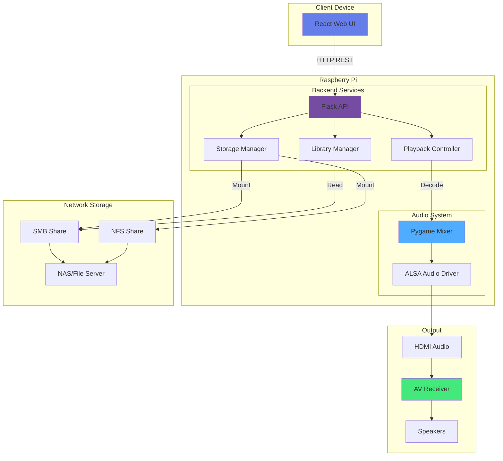
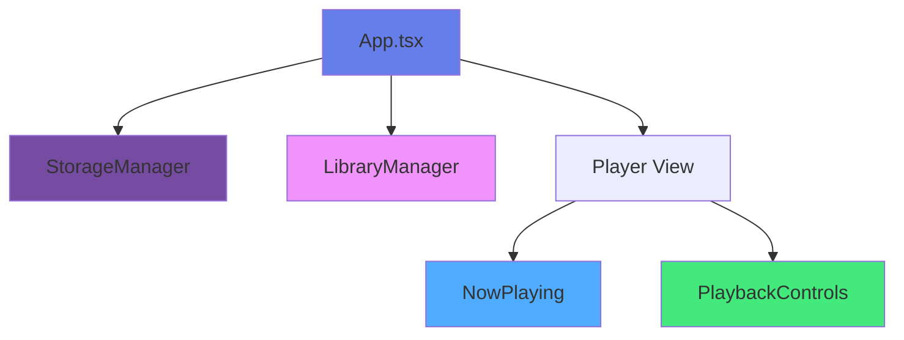
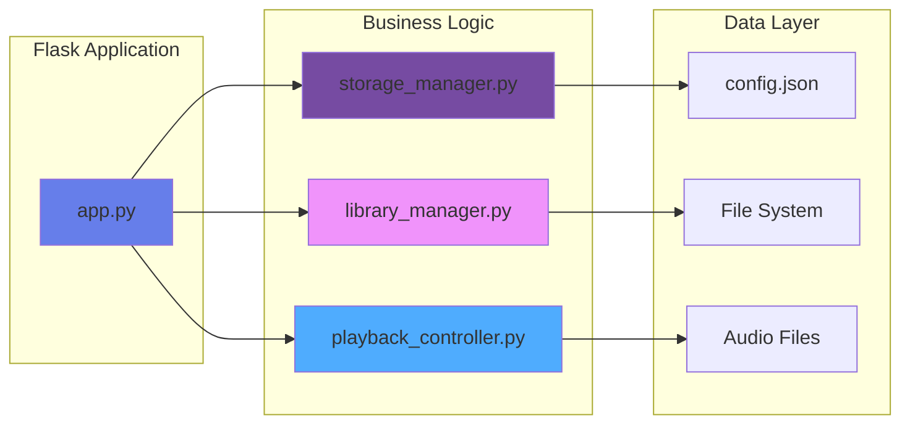
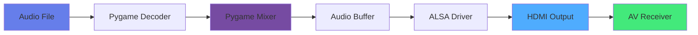
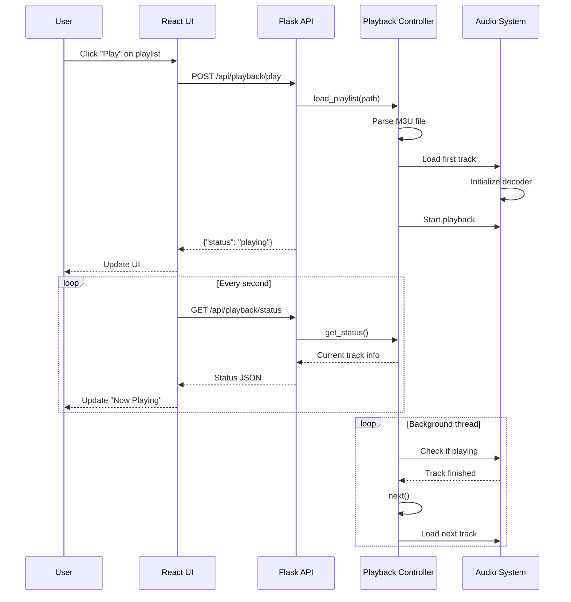
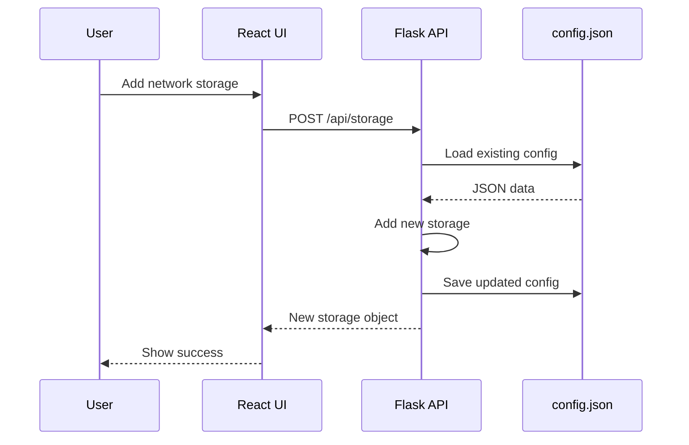
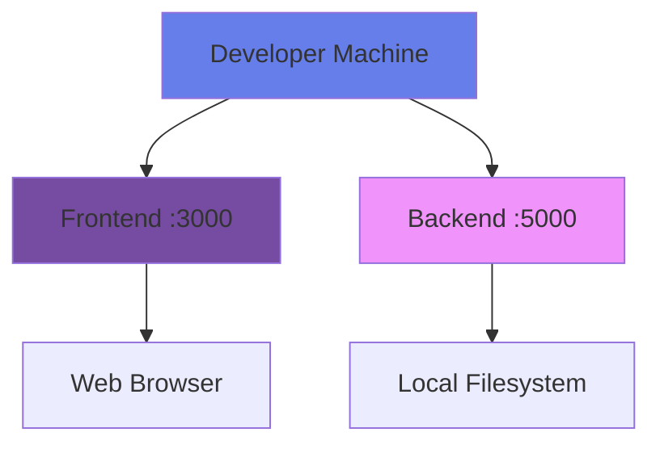
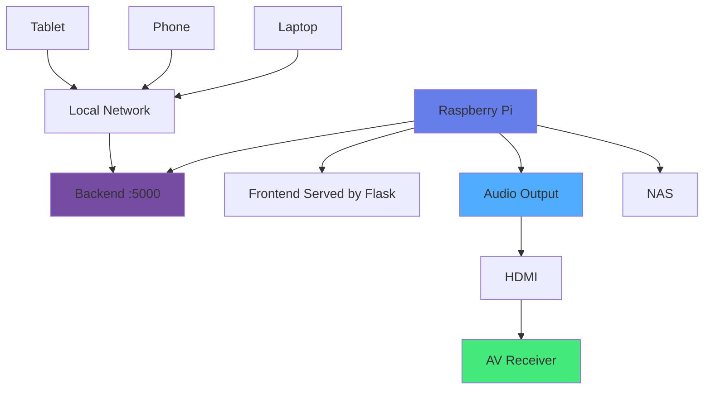

# Architecture Documentation

## System Overview

The Media Player is a distributed application consisting of three main components:

1. **React Frontend**: Web-based user interface
2. **Flask Backend**: REST API and business logic
3. **Audio Subsystem**: Pygame-based audio playback

## Component Details

### Frontend (React + TypeScript)

#### Component Hierarchy

#### Key Features

1. **Tab Navigation**: Switch between Storage, Library, and Player views
2. **Real-time Updates**: Polls playback status every second
3. **Responsive Design**: Works on desktop and mobile devices
4. **Form Management**: Dynamic forms for adding storage and libraries

#### State Management

Currently uses React hooks (`useState`, `useEffect`) for state management. For larger applications, consider Redux or Zustand.

### Backend (Python + Flask)

#### Module Structure

#### Storage Manager

Responsibilities:
- Mount network storage (SMB/CIFS, NFS)
- Manage mount points
- Track mounted storage status

**Note**: The current implementation provides the structure but requires elevated privileges for actual mounting. On Raspberry Pi, consider using `/etc/fstab` or `autofs` for automatic mounting.

#### Library Manager

Responsibilities:
- Scan directories for M3U playlists
- Parse M3U playlist files
- Provide playlist metadata

Features:
- Supports both M3U and M3U8 formats
- Handles relative and absolute paths in playlists
- Recursive directory scanning

#### Playback Controller

Responsibilities:
- Audio playback using pygame.mixer
- Playlist queue management
- Volume control
- Playback state tracking

Features:
- Auto-advance to next track
- Background monitoring thread
- Support for common audio formats (MP3, WAV, OGG, FLAC)

### Audio Pipeline

## Data Flow

### Playback Flow

### Configuration Flow

## Deployment Architecture

### Development Environment

### Production (Raspberry Pi)

## Technology Stack

### Frontend
- **Framework**: React 18 with TypeScript
- **Styling**: CSS3 with custom styles
- **HTTP Client**: Fetch API
- **Build Tool**: Create React App (Webpack under the hood)

### Backend
- **Framework**: Flask 3.0
- **CORS**: Flask-CORS
- **Audio**: Pygame 2.5
- **Metadata**: Mutagen 1.47
- **Language**: Python 3.8+

### System
- **OS**: Raspberry Pi OS (Debian-based)
- **Audio**: ALSA + HDMI
- **Network**: SMB/CIFS, NFS
- **Process Management**: systemd

## Security Considerations

### Current Implementation

⚠️ **Warning**: The current implementation is designed for private home networks and lacks security features suitable for production environments.

### Recommended Enhancements

1. **Authentication & Authorization**
   - Implement user authentication (JWT tokens)
   - Add role-based access control
   - Secure API endpoints

2. **Credential Management**
   - Encrypt stored passwords
   - Use environment variables or secrets management
   - Never commit credentials to version control

3. **Network Security**
   - Enable HTTPS with SSL certificates
   - Implement rate limiting
   - Add CSRF protection

4. **Input Validation**
   - Sanitize all user inputs
   - Validate file paths to prevent directory traversal
   - Limit file system access

5. **Deployment**
   - Run backend as non-root user
   - Use firewall rules to restrict access
   - Keep dependencies updated

## Performance Considerations

### Frontend
- **Polling Interval**: 1 second (configurable)
- **Bundle Size**: ~500KB (can be optimized with code splitting)
- **Rendering**: Virtual DOM ensures efficient updates

### Backend
- **Concurrency**: Flask development server (single-threaded)
  - For production, use Gunicorn with multiple workers
- **Audio Latency**: <100ms typical
- **Memory Usage**: ~50-100MB

### Storage
- **Network Latency**: Depends on network storage speed
- **Playlist Parsing**: O(n) where n = number of tracks
- **File System**: Standard Python I/O

## Extensibility

### Adding New Features

#### New Audio Formats
Add support in `playback_controller.py` - pygame supports most common formats through SDL2.

#### Multiple Playlists
Extend `playback_controller.py` to support queue management.

#### Audio Effects
Use pygame's sound effects or integrate external audio processing libraries.

#### Mobile App
Create a React Native app using the same API endpoints.

#### Voice Control
Integrate with voice assistants using their APIs and webhook endpoints.

## Monitoring & Logging

### Current Implementation
- Console logging with `print()` statements
- No structured logging
- No metrics collection

### Recommendations
1. Use Python's `logging` module
2. Add structured logging (JSON format)
3. Implement health check endpoint
4. Add metrics (Prometheus, StatsD)
5. Error tracking (Sentry, Rollbar)

## Backup & Recovery

### Configuration
- Backup `config.json` regularly
- Consider using configuration management (Ansible, Chef)

### Playlists
- Store playlists on network storage
- Regular backups of network storage

### System
- Create Raspberry Pi image backup
- Document setup process for quick recovery