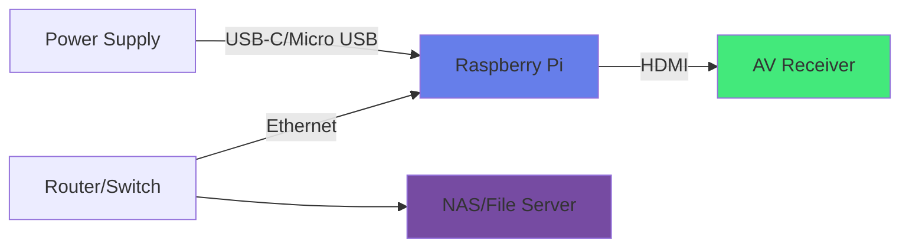

# Raspberry Pi Setup Guide

Complete guide for setting up the Media Player on a Raspberry Pi.

## Table of Contents

1. [Hardware Requirements](#hardware-requirements)
2. [Operating System Installation](#operating-system-installation)
3. [Initial Configuration](#initial-configuration)
4. [Software Installation](#software-installation)
5. [Audio Configuration](#audio-configuration)
6. [Network Storage Setup](#network-storage-setup)
7. [Application Deployment](#application-deployment)
8. [Auto-Start Configuration](#auto-start-configuration)
9. [Performance Tuning](#performance-tuning)
10. [Troubleshooting](#troubleshooting)

## Hardware Requirements

### Minimum Requirements
- **Raspberry Pi**: Model 3B or newer
- **SD Card**: 16GB minimum (32GB recommended)
- **Power Supply**: Official Raspberry Pi power supply (5V/3A for Pi 4)
- **HDMI Cable**: To connect to audio receiver
- **Network**: Ethernet or WiFi connection

### Recommended Setup
- **Raspberry Pi**: Model 4B (4GB RAM)
- **SD Card**: 32GB or larger, Class 10 or better
- **Cooling**: Heat sinks or fan for continuous operation
- **Case**: Protect the Pi from dust
- **Ethernet**: Preferred over WiFi for stability

### Connections


## Operating System Installation

### 1. Download Raspberry Pi OS

Use **Raspberry Pi OS Lite** (64-bit recommended for Pi 4):
```bash
# Download Raspberry Pi Imager
# https://www.raspberrypi.com/software/
```

### 2. Write OS to SD Card

1. Open Raspberry Pi Imager
2. Choose OS: "Raspberry Pi OS (64-bit)" or "Raspberry Pi OS Lite (64-bit)"
3. Choose Storage: Your SD card
4. Click Settings (gear icon):
   - Enable SSH
   - Set username and password
   - Configure WiFi (if needed)
   - Set hostname: `mediaplayer`
5. Click "Write"

### 3. First Boot

1. Insert SD card into Raspberry Pi
2. Connect HDMI, Ethernet, and power
3. Wait for boot (1-2 minutes)
4. Find the IP address:
   ```bash
   # From another computer
   ping mediaplayer.local
   # Or check your router's DHCP table
   ```

## Initial Configuration

### 1. Connect via SSH

```bash
ssh pi@mediaplayer.local
# Or use IP address
ssh pi@192.168.1.xxx
```

### 2. Update System

```bash
sudo apt update
sudo apt upgrade -y
sudo apt dist-upgrade -y
sudo reboot
```

### 3. Configure Raspberry Pi

```bash
sudo raspi-config
```

Recommended settings:
- **System Options**
  - Hostname: `mediaplayer`
  - Boot: Console (no desktop needed)
- **Display Options**
  - Resolution: Auto
- **Localisation Options**
  - Timezone: Your timezone
  - Keyboard: Your keyboard layout
  - WLAN Country: Your country
- **Advanced Options**
  - Expand Filesystem: Yes
  - Memory Split: 256MB (for audio processing)

### 4. Static IP (Optional but Recommended)

Edit `/etc/dhcpcd.conf`:
```bash
sudo nano /etc/dhcpcd.conf
```

Add at the end:
```conf
interface eth0
static ip_address=192.168.1.100/24
static routers=192.168.1.1
static domain_name_servers=192.168.1.1 8.8.8.8

# For WiFi, use wlan0 instead:
# interface wlan0
# static ip_address=192.168.1.100/24
# ...
```

Restart networking:
```bash
sudo systemctl restart dhcpcd
```

## Software Installation

### 1. Install Python and Dependencies

```bash
# Install Python 3
sudo apt install -y python3 python3-venv

# Tools used by the install steps
sudo apt install -y git curl ca-certificates

# Install audio libraries
sudo apt install -y libsdl2-mixer-2.0-0 libsdl2-2.0-0
```

### 2. Install uv

```bash
curl -LsSf https://astral.sh/uv/install.sh | sh

# Ensure uv is on PATH for this shell
export PATH="$HOME/.local/bin:$PATH"

# Verify
uv --version
```

### 3. Install Node.js (for building frontend)

```bash
# Install Node.js 18.x
curl -fsSL https://deb.nodesource.com/setup_18.x | sudo -E bash -
sudo apt install -y nodejs

# Verify installation
node --version
npm --version
```

### 4. Clone Repository

```bash
cd ~
git clone https://github.com/xXLAOKOONXx/media-player.git
cd media-player
```

### 5. Install Application Dependencies

```bash
# Backend
cd ~/media-player/backend

# Create and use a local virtual environment
uv venv
source .venv/bin/activate

# Install backend dependencies from pyproject.toml
uv pip install -e .

# Frontend
cd ~/media-player/frontend
npm install
npm run build

# The frontend build outputs into ../backend/static and is served by Flask.
```

## Audio Configuration

### 1. Check Audio Devices

```bash
aplay -l
```

Should show HDMI output:
```
**** List of PLAYBACK Hardware Devices ****
card 0: Headphones [bcm2835 Headphones], device 0: bcm2835 Headphones [bcm2835 Headphones]
  Subdevices: 8/8
  Subdevice #0: subdevice #0
card 1: vc4hdmi [vc4-hdmi], device 0: MAI PCM i2s-hifi-0 [MAI PCM i2s-hifi-0]
  Subdevices: 1/1
  Subdevice #0: subdevice #0
```

### 2. Configure HDMI Audio

Edit boot config:
```bash
sudo nano /boot/config.txt
```

Add or uncomment:
```conf
# Force HDMI audio
hdmi_drive=2

# If using Pi 4 with dual HDMI, specify port:
# hdmi_drive:0=2  # for HDMI 0
# hdmi_drive:1=2  # for HDMI 1
```

### 3. Set Default Audio Output

```bash
sudo raspi-config
```

Navigate to:
1. System Options
2. Audio
3. Select HDMI output

### 4. Test Audio

```bash
# Test with speaker-test
speaker-test -c 2 -t wav

# Or use aplay with a test file
aplay /usr/share/sounds/alsa/Front_Center.wav
```

### 5. Configure ALSA (if needed)

Create `~/.asoundrc`:
```bash
nano ~/.asoundrc
```

Content:
```conf
pcm.!default {
    type hw
    card 1  # Use card number from aplay -l
    device 0
}

ctl.!default {
    type hw
    card 1
}
```

### 6. Set Pygame Audio

Edit backend code or set environment variable:
```bash
export SDL_AUDIODRIVER=alsa
```

## Network Storage Setup

### 1. Install CIFS/SMB Support

```bash
sudo apt install -y cifs-utils
```

### 2. Install NFS Support

```bash
sudo apt install -y nfs-common
```

### 3. Create Mount Points

```bash
sudo mkdir -p /mnt/media_1
sudo mkdir -p /mnt/media_2
sudo chown pi:pi /mnt/media_*
```

### 4. Manual Mount Test

```bash
# For SMB/CIFS
sudo mount -t cifs //192.168.1.10/music /mnt/media_1 \
  -o username=user,password=pass,uid=1000,gid=1000

# For NFS
sudo mount -t nfs 192.168.1.10:/export/music /mnt/media_1
```

### 5. Configure /etc/fstab (for automatic mounting)

```bash
sudo nano /etc/fstab
```

Add entries:
```conf
# SMB/CIFS
//192.168.1.10/music /mnt/media_1 cifs credentials=/home/pi/.smbcredentials,uid=1000,gid=1000,iocharset=utf8 0 0

# NFS
192.168.1.10:/export/music /mnt/media_2 nfs defaults,user,auto 0 0
```

### 6. Create Credentials File

```bash
nano ~/.smbcredentials
```

Content:
```conf
username=your_username
password=your_password
domain=WORKGROUP
```

Secure the file:
```bash
chmod 600 ~/.smbcredentials
```

### 7. Test Auto-Mount

```bash
sudo mount -a
df -h | grep /mnt
```

## Application Deployment

### 1. Configure Backend

```bash
cd ~/media-player/backend
nano config.json
```

Create initial config (or it will be created automatically):
```json
{
  "network_storages": [],
  "libraries": []
}
```

### 2. Test Backend

```bash
cd ~/media-player/backend
python3 app.py
```

Should see:
```
 * Serving Flask app 'app'
 * Debug mode: on
 * Running on http://0.0.0.0:5000
```

Test from another terminal:
```bash
curl http://localhost:5000/api/playback/status
```

### 3. Configure Frontend Proxy (Optional)

If serving frontend separately, configure proxy.

Edit `frontend/package.json`:
```json
{
  "proxy": "http://localhost:5000"
}
```

Or use environment variable in production:
```bash
export REACT_APP_API_URL=http://mediaplayer.local:5000
```

## Auto-Start Configuration

### 1. Create Systemd Service

```bash
sudo nano /etc/systemd/system/mediaplayer.service
```

Content:
```ini
[Unit]
Description=Media Player Backend
After=network.target multi-user.target

[Service]
Type=simple
User=pi
WorkingDirectory=/home/pi/media-player/backend
Environment="SDL_AUDIODRIVER=alsa"
Environment="DISPLAY=:0"
ExecStart=/usr/bin/python3 /home/pi/media-player/backend/app.py
Restart=always
RestartSec=10
StandardOutput=journal
StandardError=journal

[Install]
WantedBy=multi-user.target
```

### 2. Enable and Start Service

```bash
# Reload systemd
sudo systemctl daemon-reload

# Enable service (start on boot)
sudo systemctl enable mediaplayer.service

# Start service now
sudo systemctl start mediaplayer.service

# Check status
sudo systemctl status mediaplayer.service
```

### 3. View Logs

```bash
# View recent logs
sudo journalctl -u mediaplayer.service -n 50

# Follow logs in real-time
sudo journalctl -u mediaplayer.service -f

# View logs since last boot
sudo journalctl -u mediaplayer.service -b
```

### 4. Service Management Commands

```bash
# Stop service
sudo systemctl stop mediaplayer.service

# Restart service
sudo systemctl restart mediaplayer.service

# Disable auto-start
sudo systemctl disable mediaplayer.service

# Check if enabled
sudo systemctl is-enabled mediaplayer.service
```

## Performance Tuning

### 1. Optimize Audio Buffer

Edit backend code to adjust buffer size:
```python
pygame.mixer.init(frequency=44100, size=-16, channels=2, buffer=4096)
```

### 2. Increase Process Priority

Edit systemd service:
```ini
[Service]
Nice=-10
IOSchedulingClass=realtime
IOSchedulingPriority=0
```

### 3. Disable Unnecessary Services

```bash
# List services
sudo systemctl list-unit-files --type=service

# Disable unnecessary services
sudo systemctl disable bluetooth.service
sudo systemctl disable cups.service
sudo systemctl disable avahi-daemon.service
```

### 4. Reduce Memory Usage

Edit `/boot/config.txt`:
```conf
# Reduce GPU memory (console only)
gpu_mem=16

# Or for video playback support later:
gpu_mem=128
```

### 5. Overclock (Raspberry Pi 4)

Edit `/boot/config.txt` (at your own risk):
```conf
over_voltage=2
arm_freq=1750
```

## Troubleshooting

### No Audio Output

```bash
# Check ALSA configuration
aplay -l

# Test audio
speaker-test -t wav -c 2

# Check pygame mixer
python3 -c "import pygame; pygame.mixer.init(); print('OK')"

# Check HDMI connection
/usr/bin/tvservice -s
```

### Service Won't Start

```bash
# Check service status
sudo systemctl status mediaplayer.service

# View detailed logs
sudo journalctl -u mediaplayer.service -n 100

# Test manually
cd ~/media-player/backend
python3 app.py
```

### Network Storage Not Mounting

```bash
# Test connection
ping 192.168.1.10

# Test SMB connection
smbclient -L //192.168.1.10 -U username

# Check mount
mount | grep /mnt

# Manually unmount
sudo umount /mnt/media_1

# Try mounting again
sudo mount -a
```

### High CPU Usage

```bash
# Check process usage
top

# Monitor specific process
pidof python3
top -p <pid>

# Reduce polling frequency in frontend
# Edit App.tsx, increase interval from 1000ms to 2000ms
```

### Web UI Not Accessible

```bash
# Check if service is running
sudo systemctl status mediaplayer.service

# Check if port is listening
sudo netstat -tlnp | grep 5000

# Check firewall (if enabled)
sudo ufw status

# Test locally
curl http://localhost:5000/api/playback/status

# Check from another device
curl http://mediaplayer.local:5000/api/playback/status
```

## Maintenance

### Regular Updates

```bash
# Update system
sudo apt update
sudo apt upgrade -y

# Update Python packages
cd ~/media-player/backend
source .venv/bin/activate
uv pip install -e . --upgrade

# Update application
cd ~/media-player
git pull
sudo systemctl restart mediaplayer.service
```

### Backup Configuration

```bash
# Backup config
cp ~/media-player/backend/config.json ~/config.json.backup

# Backup entire system (create image)
# Use Win32DiskImager or dd on Linux
```

### Monitor System Health

```bash
# Check temperature
vcgencmd measure_temp

# Check disk space
df -h

# Check memory
free -h

# Check system load
uptime
```

## Next Steps

1. Access web UI: `http://mediaplayer.local:5000`
2. Configure network storage in Storage tab
3. Add libraries in Library tab
4. Start playing music!

## Additional Resources

- [Raspberry Pi Documentation](https://www.raspberrypi.com/documentation/)
- [Pygame Documentation](https://www.pygame.org/docs/)
- [Flask Documentation](https://flask.palletsprojects.com/)
- [systemd Documentation](https://www.freedesktop.org/software/systemd/man/)